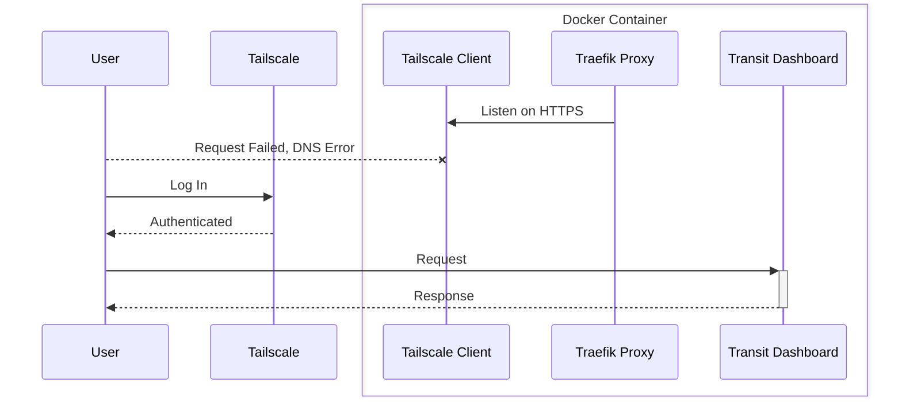

# 🚇 Transit Dashboard


**Disclaimer:** This is an unofficial hobby project developed by me using the Transit API. It is in no way affiliated with the Transit App/team.

## Features

- [x] Pick some nearby stations
- [x] Display next three departures at a station in a tabular format
- [x] Cache and debounce API queries to stay within API quota
- [x] Bookmark the final URL for easy access
## Development

1. [Install Nix](https://github.com/DeterminateSystems/nix-installer)
2. Obtain access to the [Transit App API](https://transitapp.com/apis).
3. Obtain a [Google Maps API key](https://developers.google.com/maps/documentation/javascript/place-autocomplete)
4. Copy `.env.example` to `.env` and edit it. Fill in your API keys.
5. Start the project:

    ```
    nix develop
    deno task start
    ```

    This will watch the project directory and restart as necessary.

## Deployment

A Docker image can be built that bundles the application with a [Tailscale client](https://tailscale.com$). A [Traefik proxy](https://traefik.io/) is configured to proxy all Tailscale-authenticated traffic through a tunnel to the application.



You can build and deploy the image yourself with:

```sh
nix build .#nix2containerImage.copyToDockerDaemon && ./result/bin/copy-to-docker-daemon
docker run \
    --rm \
    --env-file .env \
    -v /dev/net/tun:/dev/net/tun \
    -v ./tailscale:/var/lib/tailscale \
    -v ./cache:/app/cache \
    --cap-add NET_ADMIN \
    --cap-add SYS_MODULE \
    --hostname transit-dashboard \
    --name transit-dashboard \
    transit-dashboard:latest
```

