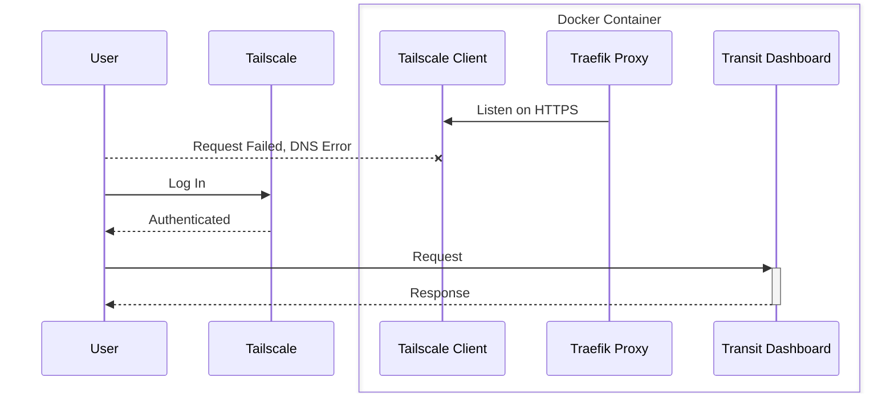

# 🚇 Transit Dashboard


**Disclaimer:** This is an unofficial hobby project developed by me using the
Transit API. It is in no way affiliated with the Transit App/team.

## Features

- [x] Pick some nearby stations
- [x] Display next three departures at a station in a tabular format
- [x] Cache and debounce API queries to stay within API quota
- [x] Bookmark the final URL for easy access

## Development

1. [Install Nix](https://github.com/DeterminateSystems/nix-installer)
2. Obtain access to the [Transit App API](https://transitapp.com/apis).
3. Obtain a
   [Google Maps API key](https://developers.google.com/maps/documentation/javascript/place-autocomplete)
4. Copy `.env.example` to `.env` and edit it. Fill in your API keys.
5. Start the project:

   ```
   nix develop
   deno task dev
   ```

   This will watch the project directory and restart as necessary.

### Amp orbs

This repo includes Amp orb configuration under `.agents/`:

- `.agents/setup` installs Deno if needed and installs locked dependencies.
- `.agents/resume` restarts the dev server on orb wake-up if it is not already
  healthy.
- `.agents/run-checks` runs all project checks and emits one status line while
  writing verbose output to `.amp/in/checks.log`.
- `.agents/Procfile` starts the Vite/Fresh dev server on `0.0.0.0:5173`.
- `.agents/portal` documents the app port for sharing from an orb.
- `.amp/plugins/cheap-checks.ts` exposes `run_checks_subagent`, a cheap
  `gpt-5-nano`/no-reasoning subagent tool for compact check status.

Copy `.env.example` to `.env` and fill in real API keys before using live
Transit or Google Maps features.

## Deployment

A Docker image can be built that bundles the application with a
[Tailscale client](https://tailscale.com$). A
[Traefik proxy](https://traefik.io/) is configured to proxy all
Tailscale-authenticated traffic through a tunnel to the application.


```mermaid
sequenceDiagram
    participant User
    participant Tailscale
    box Docker Container
        participant Tailscale Client
        participant Traefik Proxy
        participant Transit Dashboard
    end
    Traefik Proxy->>Tailscale Client: Listen on HTTPS
    User--xTailscale Client: Request Failed, DNS Error
    User->>Tailscale: Log In
    Tailscale-->>User: Authenticated
    User->>+Transit Dashboard: Request
    Transit Dashboard-->>-User: Response
```

You can build and deploy the image yourself with:

```sh
nix build .#nix2containerImage.copyToDockerDaemon && ./result/bin/copy-to-docker-daemon
docker run \
    --rm \
    --env-file .env \
    -v /dev/net/tun:/dev/net/tun \
    -v ./tailscale:/var/lib/tailscale \
    -v ./cache:/app/cache \
    --cap-add NET_ADMIN \
    --cap-add SYS_MODULE \
    --hostname transit-dashboard \
    --name transit-dashboard \
    transit-dashboard:latest
```
